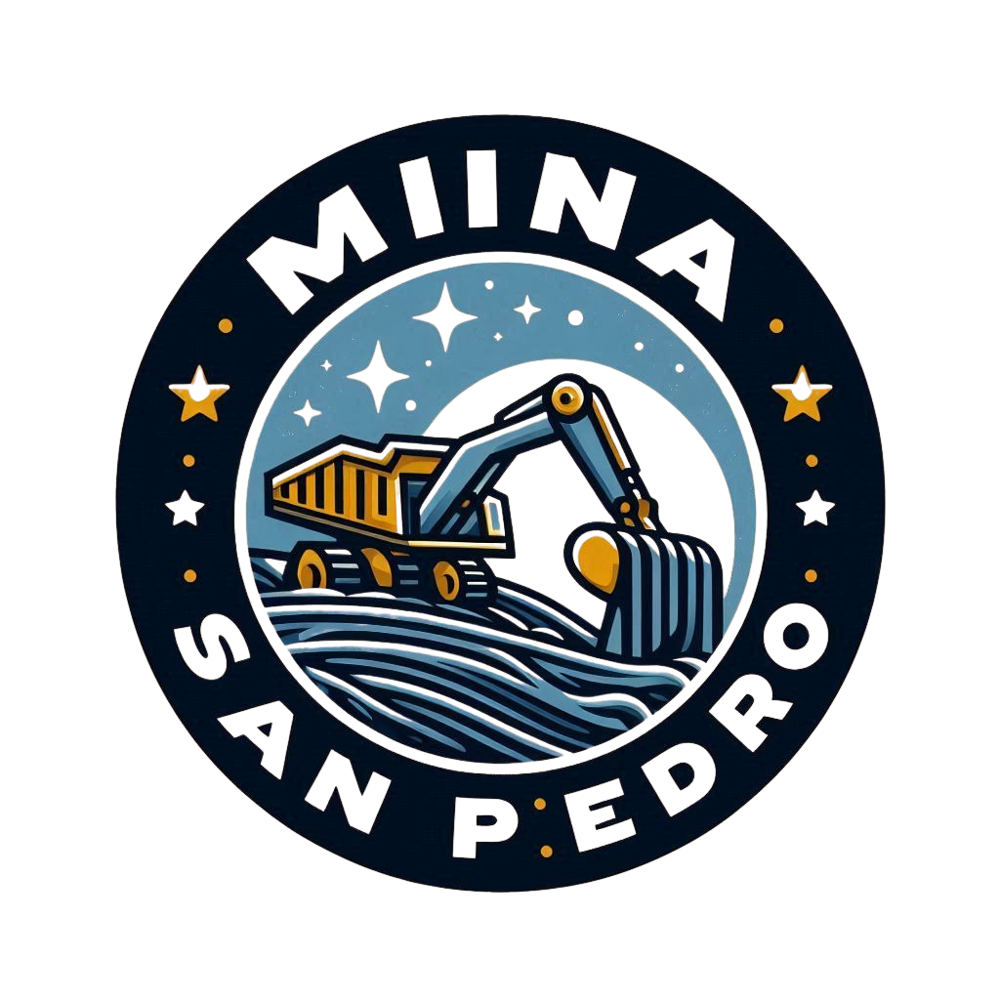

# Mina San Pedro - Sistema de Gestión de Productos



## Descripción
Sistema web desarrollado en Laravel para la gestión de productos y materiales extraídos en Mina San Pedro. Permite administrar productos, registrar ventas, gestionar usuarios y suscripciones por correo, y mucho más, con una interfaz moderna y responsiva.

## Características principales
- Gestión de productos y materiales extraídos
- Autenticación de usuarios
- Recuperación y verificación de correo
- Suscripción a newsletter con AJAX
- Panel de administración
- Interfaz elegante y responsiva

## Requisitos
- PHP >= 8.0
- Composer
- MySQL o MariaDB
- Node.js y npm (opcional, para compilar assets)

## Instalación
1. Clona el repositorio:
   ```bash
   git clone https://github.com/angelrubiodt/proyectoLaravel.git
   cd proyectoLaravel
   ```
2. Instala dependencias:
   ```bash
   composer install
   ```
3. Copia el archivo de entorno y configura tus variables:
   ```bash
   cp .env.example .env
   # Edita .env con tus datos de base de datos y correo
   ```
4. Genera la clave de la aplicación:
   ```bash
   php artisan key:generate
   ```
5. Ejecuta las migraciones y seeders:
   ```bash
   php artisan migrate:fresh --seed
   ```
6. (Opcional) Compila los assets:
   ```bash
   npm install && npm run dev
   ```
7. Inicia el servidor:
   ```bash
   php artisan serve
   ```

## Acceso al sistema
- **Usuario por defecto:** rubioagl@gmail.com
- **Contraseña:** password

Puedes cambiar estos datos en la base de datos o editando el seeder `UserSeeder.php`.

## Suscripción al newsletter
Los correos de suscriptores se almacenan en la tabla `newsletters` y el proceso es totalmente interactivo y validado.

## Autor
**Angel Rubio**

## Licencia
Este proyecto está bajo la licencia MIT.
